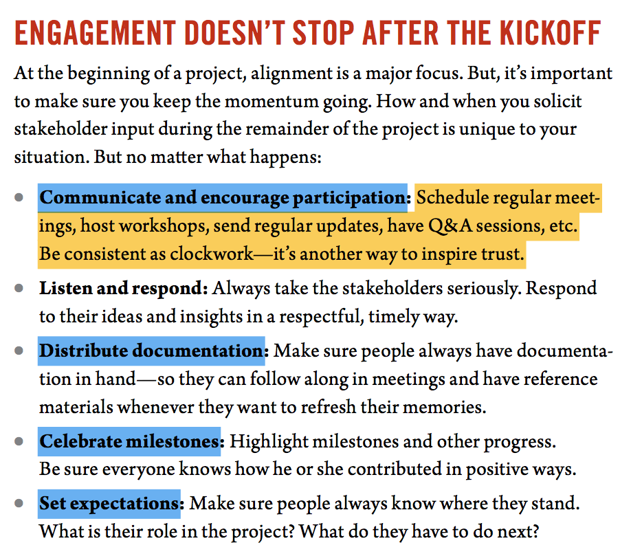

# Content Strategy for the Web

## Foreword

 - I needed to find a way to introduce real content strategy into a system that was hardwired to reject anything that might gunk up the works.

 - Instead, I heeded the "move fast" writing on the walls and focused on gaining quick wins.

 - A quick checklist for success
  + Demonstrate value on your own terms
  + Apply content strategy to your content strategy
  + Friend everyone

## Introduction

 - We wrote this book for people who want to understand what content strategy is, why it's important, and how to go about getting it done.

 - Some specific topics the book _does not cover_:
    + Translation and localization
    + Content marketing
    + Social media planning
    + SEO
    + CMS strategy (software selection, design, and implementation)

 - You can redesign a homepage. You can buy a new CMS. But unless you treat your content with strategic consideration, you can't fix your website.

## Reality

### NOW

 - THINK BIG, START SMALL
    1. Do less, not more.
    2. Figure out what you have and where it's coming from.
    3. Learn how to listen.
    4. Put someone in charge.
    5. Take action... now.

#### 1) Do less, not more

 - Generally speaking, content is more or less worthless unless it does one or both of the following:

    + Supports a key business objective
    + Fulfills your users'needs

 - **Less content is easier to manage**
 - Repeat: **less content is easier to manage**

 - **Scaling back on content**
    + Ensure that your online content maps to key business objectives and user goals
    + Create a web editorial calendar that specifies when and why new content will be published.

#### 2) Figure out what you have and where it's coming from

 - You may dream of throwing out your old content and starting over. **Reality would like to disagree.**

 - _Content Audit:_ An accounting of all currently published web content, with all the details recorded in a spreadsheet

 - Two kinds of audits:
    + Quantitative inventories: _what's where_
    + Qualitative assessments: _is it any good?_

 - Showing a content audit like:
 > Yes, hello, have you seen what a disaster our websit is lately?

#### 3) Learn How to Listen

 - Content problems exist because no one asked the right questions: the ones that focus on the people and processes to impact its lifecycle

 - Even when you _are_ asking the right questions... **you gotta know how to listen**

 - **Listen to your colleagues**
 - **Listen to your users**

 - Stop assuming you already know the answers to the questions you've been asking

 - For more information on asking questions: Chapter 4 (Alignment) and Chapter 6 (Analysis)

#### 4) Put someone in charge

 - Have a person **in charge** of your content otherwise nothing will fucking work

 - Have someone to say no

#### 5) Take action... NOW

 - Fake it 'till you make it: dive in and learn to swim along the way

---

## Discovery

### Alignment

 - Alignment is not necessarily about creating consensus. It's about creating a common understanding.

 - Learn to:
    + Identify your stakeholders
    + Convince them to participate
    + Set the stage for alignment with a kickoff
    + Get them engaged
    + Keep them motivated throughout the project

 - You can often predict how successful your content strat will be by how receptive collaborators are

 - Lots of people affect your content: acknowledge and understanding collaborators' ideas, issues, and opinions

 - Your content affects lots of people: and you'll need their trust. Show them where they acn contribute and how they will benefit

**How to involve stakeholders in the content plan**

**Kick off on the right foot**

