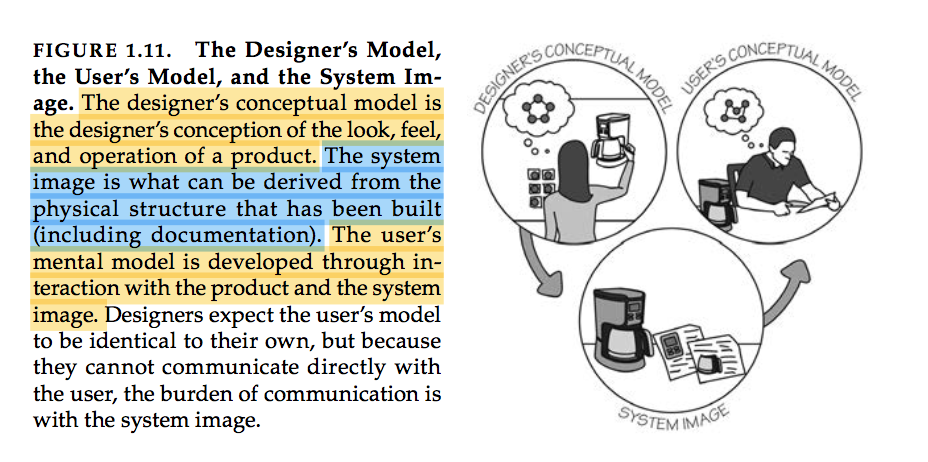
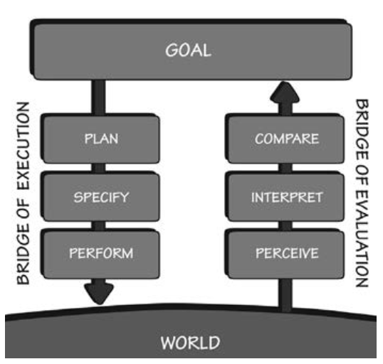
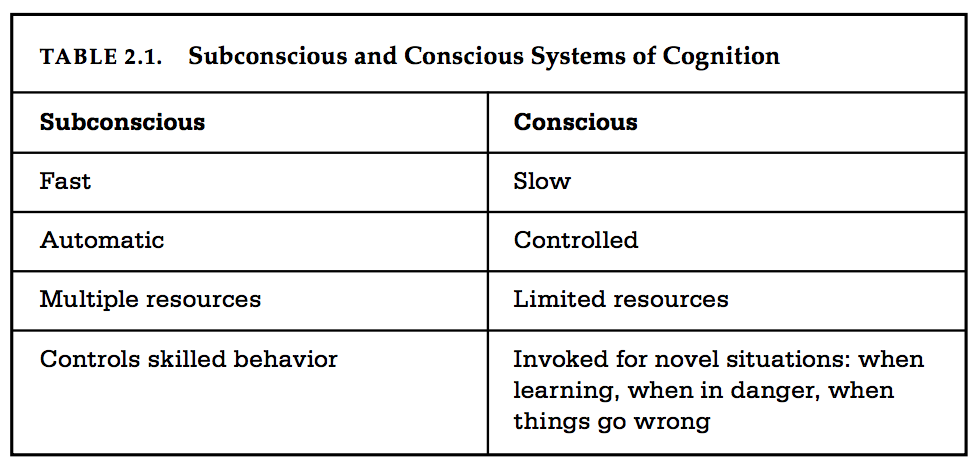

# Notes on 'The Design of Everyday Things'

## 1. The Psychopathology of Everyday Things

### Affordances

A chair affords ("is for") support, and therefore affords sitting.

_has_ affordance: `true | false`

_affords_:

```javascript
 let affordance = true

 affordance = {
   sitting: true
   lifting: false
   wheeling: false
 }
```

**Affordance** = qualities of the object + abilities of the agent ~~~ a relationship (not a property)

anti-affordance: negatives that the object expresses (nono's)

### Signifiers

 - Affordances determine what actions are possible, while signifiers communicate where the action should take place.

 - Good design requires good communication of the purpose, structure, and operation of the device to people who use it.

**That is the role of the signifier**

We need to develop internal models of what things mean.

**We are detectives**

### Mapping

 - The relationship between the elements of two sets of things.

 - In steering a car, we rotate the steering wheel clockwise to cause the car to turn right: the top of the wheel moves in the same directions as the car.

 - The relationship between a control and its results is easiest to learn wherever there is an understandable mapping between the controls, the actions, and the intended result.

    + Natural mapping [...] leads to immediate understanding.

 - A device is easy to use when the set of possible actions is visible, when the controls and displays exploit natural mappings.

### Feedback

**Feedback**: Some way of letting you know that the system is working on your request.

 -  Even as simple a task as picking up a glass with the hand requires feedback to aim the hand properly, to grasp the glass, and to lift it.

- Too many announcements cause people to ignore all of them, or wherever possible, disable all of them, which means that critical and important ones are apt to be missed. Feedback is essential, but not when it gets in the way of other things, including a calm and relaxing environment.

 - Feedback has to be planned. Feedback must also be prioritized, so that [...] important signals are presented in a way that does capture attention.

### Conceptual Models

 - A conceptual model is an explanation, usually highly simplified, of how something works.

 - [...] there are no folders inside the computer — those are effective conceptualizations designed to make them easier to use.

 - Simplified models are valuable only as long as the assumptions that support them hold true.

 - Mental models [...] are the conceptual models in people's minds that represent their understanding of how things work.

    + Different people may hold different mental models of the same item.

 - Usually the device offers very little assistance, so the model is constructed by experience.

 - The major clues to how things work from their perceived structure — in particular from signifiers, affordances, constraints and mappings.

> **Conceptual model >>> device**  
> **Mental model >>> user**  

- Conceptual models are valuable in providing understanding, in predicting how things will behave, and in figuring out what to do when things do not go as planned. **A good conceptual model allows us to predict the effect of our actions [as users].**

- Understand the relationship between the controls and the outcomes.

### The System Image

- I call the combined information available to us the _system image_.

> _The sum of all available affordance and signifiers?_



### The Paradox of technology

- [smart watches have] so many things to control, so little space for controls or signifiers.

- The same technology that simplifies life by providing more functions in each device also complicates life by making the device harder to learn, harder to use. **This is the paradox of technology and the challenge for the designer**

## The Psychology of Everyday Actions

### How do people do things: The Gulfs of Execution and Evaluation

 - When people use something, they face two gulfs:

    + The Gulf of Execution, where they try to figure out how it operates

    + The Gulf of Evaluation, where they try to figure out what happened

 - The gulf of evaluation reflects the amount of effort that the person must make to interpret the physical state of the device and to determine how well the expectations and intentions have been met.

 - Gulf of Execution: signifiers, constraints, mappings and a conceptual model.

 - Gulf of Evaluation: Feedback and a good conceptual model.


### The Seven Stages of Action

 - There are to parts to an action: executing the action and then evaluating the results: doing and interpreting.



 1. Goal (form the goal)

 2. Plan (the action)

 3. Specify (an action sequence) 4. Perform (the action sequence)

 5. Perceive (the state of the world)

 6. Interpret (the perception)

 7. Compare (the outcome with the goal)  


 - Root cause analysis: asking "Why?" until the ultimate, fundamental cause of the activity is reached.

 - Goal-driven behavior: starts with the goal and then goes through the three stages of Execution

 - Event-driven (data-driven) behavior: triggered by some event in the world, goes through the three stages of the evaluation, and then execution.

 - Opportunistic actions are those in which the behavior takes advantage of circumstances.

 - Opportunistic actions are less precise and certain than specified goals and intentions, **but they result in less mental effort, less inconvenience** and perhaps more interest.

- What about radical ideas, ones that introduce new product categories to the marketplace? These come about by reconsidering the goals, and always asking what the real goal is: _root cause_ analysis.

> "People don't want to buy a quarter-inch drill. They want to buy a quarter-inch hole!"

- Actually, people don't want a hole either... they want to install a bookshelf

- And... why not develop methods that don't require holes? Or perhaps books that don't require bookshelves.

### Human Thought: Mostly Subconscious

 - Why do we need to know about the human mind? Because things are designed to be used by people, and without a deep understanding of people, the designs are apt to be faulty

 - **Overlearning**: Once skills have been overlearned, performance appears to be effortless, done automatically, with little or no awareness -- you simply "know" the answer.

 - **Declarative Memory**: Memory for factual information -- mostly automatic

- **Procedural Memory**: Memory that needs to engage in conscious, reflective problem-solving to be properly retrieved.

---

- **Subconcious thought** matches patterns, finding the best possible match of one's past experience to the current one. _It proceeds rapidly and automatically, without effort_.

- **Conscious thought** is quite different. It is slow and labored. Here is where we slowly ponder decisions, think through alternatives, compare different choices, rationalizing, finding explanations.



- A positive emotional state is ideal for creative thought, but it is not very well suited for getting things done.

- A brain in a negative emotional state provides focus: precisely what is needed to maintain attention on a task and finish it.


### Human Cognition and Emotion

- Three levels of processing: visceral, behavioral, and reflective.

#### The Visceral Level

 - Lizard brain

 - The basic biology of the visceral system minimizes its ability to learn. Visceral responses are fast and automatic

 - Responds to the immediate present and produces an affective state, relatively unnafected by context or history.

  - [Visceral responses] are precursors to emotion.

  - Appearances, whether sound or sight, touch or smell, drive the visceral response. **This has nothing to do with how usable, effective, or understandable the product is.**

  - Great designers use their aesthetic sensibilities o drive these visceral responses.

#### The Behavioral Level

 - The _behavioral_ level is the home of learned skills, triggered by situations that match the appropriate patterns.

 - Actions and analyses at this level are largely subconscious.

 - When we speak, we often do no know what we are about to say until our conscious mind (the reflective part of the mind) hears ourselves uttering the words.

 - When we perform a well-learned action, all we have to do is think of the goal and the behavioral level handles all the details

 **Every action is associated with an expectation**

 - Expect a positive outcome, and the result is a _positive affective response_

 - Expect a negative outcome and the result is a _negative affective response_

 - The information in the feedback loop of evaluation confirms or disconfirms the expectation, resulting in satisfaction or relief, disappointment or frustration.

 - _Behavioral states are learned_. They give rise to a feeling of control when there is good understanding and knowledge of results

 - Feedback provides reassurance, even when it indicates a negative result. A lack of feedback creates a feeling of lack of control, which can be unsettling.

 - Feedback — knowledge of results — is how expectations are resolved and is critical to learning and the development of skilled behavior.

 > NOTE
 > Users need **clear usability states** to attach to their behavioral expectations (this is working, this is loading, this is done) in order to feel like experts.
 >
 > Experts know what happens next, can repeat actions with ease and are able to take action faster than most users.

 - The emotional system is especially responsive to changes in states – so an upward change is interpreted positively even if it is only from a very bad state to a not-so-bad state

#### The Reflective Level

 - The _reflective_ level is the home of conscious cognition. [...] this is where deep understanding develops, where reasoning and conscious decision-making take place.

 - Reflection is cognitive, deep, and slow. It often occurs after the events have happened. It is a reflection or looking back over them, evaluating the circumstances, actions, and outcomes, often assessing blame or responsibility.

 > NOTE
 > How to speed up reflective decision-making on users?

 - Adding causal elements to experienced events leads to such emotional states as guilt and pride [...], blame and praise.

#### Design must take place at all levels: visceral, behavioral, and reflective

 - Reflective responses are part of our memory of events

 - It is reflection that drives us to recommend a product [...] or perhaps to avoid it.

 - **Reflective memories are often more important than reality.**

 - Similarly, too much frustration, **especially toward the ending stage of use**, and our reflections about the experience might overlook the positive visceral qualities.
